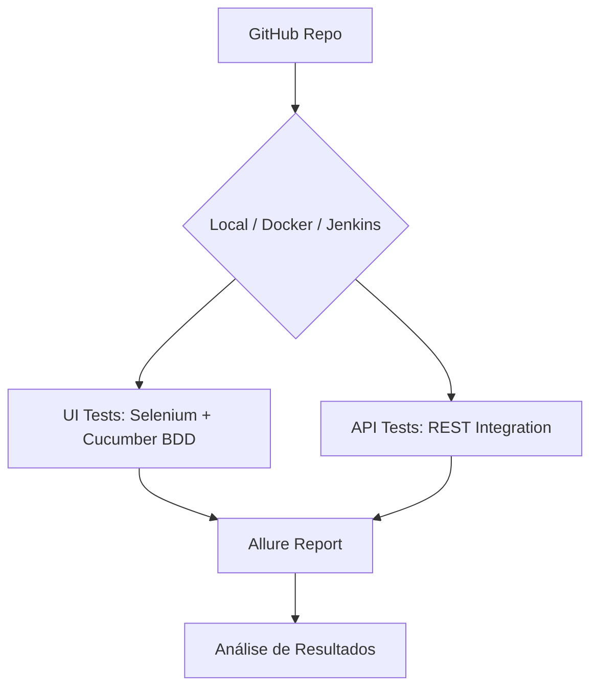

# 🏢 Cielo Testes — Automação Web + API com Java Selenium


Projeto de automação de testes para o portal **Cielo** utilizando **Java 17 + Selenium 4 + Cucumber BDD + Maven**, com suporte a execução containerizada via Docker e pipeline Jenkins. Construído com a assistência da IA **Antigravity** (Google DeepMind).

---

## 🏗️ Arquitetura do Projeto



---

## 📋 Índice

- [Tecnologias Utilizadas](#-tecnologias-utilizadas)
- [Pré-requisitos](#-pré-requisitos)
- [Instalação e Configuração](#-instalação-e-configuração)
- [Executando os Testes](#-executando-os-testes)
- [Estrutura do Projeto](#-estrutura-do-projeto)
- [Casos de Teste Cobertos](#-casos-de-teste-cobertos)
- [Relatórios de Teste](#-relatórios-de-teste)

---

## 🛠 Tecnologias Utilizadas

| Tecnologia | Versão | Descrição |
|---|---|---|
| **Java** | 17 | Linguagem principal |
| **Selenium** | 4.x | WebDriver para testes de UI |
| **Cucumber** | 7.x | BDD com Gherkin em Português |
| **Maven** | 3.x | Build e gerenciamento de dependências |
| **Allure** | 2.x | Relatórios de testes detalhados |
| **Docker** | - | Execução containerizada |
| **Jenkins** | - | Pipeline de CI/CD |

---

## ✅ Pré-requisitos

- [Java JDK](https://adoptium.net/) versão 17 ou superior
- [Maven](https://maven.apache.org/) versão 3.8+
- [Google Chrome](https://www.google.com/chrome/) instalado
- [Docker Desktop](https://www.docker.com/products/docker-desktop/) (opcional, para execução containerizada)

---

## 🚀 Instalação e Configuração

1. **Clone o repositório:**
```bash
git clone https://github.com/Rafael-M-Sales/cielo-testes.git
cd cielo-testes
```

2. **Compile o projeto:**
```bash
mvn clean compile
```

---

## ▶️ Executando os Testes

### Executar todos os cenários
```bash
mvn test
```

### Executar com Docker Compose
```bash
docker-compose up --build --abort-on-container-exit --exit-code-from tests
```

### Gerar e abrir relatório Allure
```bash
mvn allure:report
mvn allure:serve
```

### Variáveis de Ambiente
| Variável | Descrição | Padrão |
|---|---|---|
| `SELENIUM_REMOTE_URL` | URL do Selenium Grid | Local |
| `browser` | Navegador | `chrome` |
| `headless` | Modo sem interface | `true` |

---

## 📁 Estrutura do Projeto

```
cielo-testes/
├── src/
│   └── test/
│       ├── java/
│       │   ├── api/
│       │   │   └── CieloApiTests.java       # Testes de API
│       │   ├── pages/                        # Page Object Model
│       │   │   ├── BasePage.java             # Classe base
│       │   │   ├── HomePage.java             # Página inicial
│       │   │   ├── LoginPage.java            # Login
│       │   │   ├── CheckoutPage.java         # Checkout
│       │   │   ├── MaquininhasPage.java      # Maquininhas
│       │   │   ├── EcommercePage.java        # E-commerce
│       │   │   └── SolucoesPage.java         # Soluções
│       │   ├── runner/
│       │   │   └── TestRunner.java           # Ponto de entrada Cucumber
│       │   ├── steps/
│       │   │   ├── CieloSteps.java           # Steps BDD
│       │   │   └── Hooks.java                # WebDriver lifecycle
│       │   └── utils/                        # Utilitários
│       │       ├── DriverFactory.java
│       │       ├── ConfigReader.java
│       │       └── ElementHelper.java
│       └── resources/
│           ├── features/                     # 12 arquivos .feature (pt-BR)
│           ├── config.properties
│           └── allure.properties
├── docker-compose.yaml
├── Dockerfile
├── Jenkinsfile
├── pom.xml
└── README.md
```

---

## 👨‍🏫 Foco Educativo e Didático

Este projeto segue as melhores práticas de engenharia de QA:
- **Page Object Model (POM)**: Separação clara entre a lógica de interação e os cenários de teste.
- **Hooks de Teste**: Configuração e limpeza automática do estado do navegador.
- **Containerização**: Execução consistente em qualquer ambiente via Docker.
- **Pipeline CI/CD**: Jenkinsfile pronto para integração contínua.

---

## 🧾 Casos de Teste Cobertos

### 🌐 Automação Web (Portal Cielo)

| # | Feature | Funcionalidade | Cenários |
|---|---|---|---|
| 1 | Popup e Cookies | Gestão de consentimento | Aceite de cookies |
| 2 | Maquininhas | Catálogo de produtos | Navegação e validação |
| 3 | E-commerce | Soluções digitais | Exploração de recursos |
| 4 | Soluções | Serviços Cielo | Listagem e detalhes |
| 5 | Blog | Conteúdo editorial | Acesso e navegação |
| 6 | Ajuda | Central de suporte | FAQ e contato |
| 7 | Baixe o App | Download mobile | Links de download |
| 8 | Login | Autenticação | Login válido/inválido |
| 9 | Seja Cielo | Cadastro | Fluxo de adesão |
| 10 | Começar a Vender | Onboarding | Jornada do vendedor |
| 11 | Homepage Coverage | Cobertura geral | Elementos da home |
| 12 | API Integration | Integração REST | Endpoints internos |

---

## 👤 Autor

**Rafael M. Sales**

---

## 📄 Licença

Este projeto está sob a licença MIT.
